# Jetta Service Status

External status page for Jetta-managed services and critical vendor dependencies across Jetta Intelligence, AIC, and Greenmark.

- Public site target: https://status.jettaintelligence.com
- Status repo: https://github.com/jetta-operating/status.jettaintelligence.com
- Runtime: GitHub Actions + GitHub Pages via Upptime
- Access: Cloudflare Access protects the custom hostname before content loads
- Identity model: users log in through the same Cloudflare Access team used by
  `login.jettaintelligence.com`; the login admin app is the control plane, not
  a separate identity provider
- Railway dependency: monitored by this repo, not used to host this status plane
- Vendor dependencies: Vercel, OpenRouter, Claude/Anthropic, OpenAI/ChatGPT, Supabase, GitHub, and Railway
- Theme: Jetta-branded Upptime theme in [`assets/jetta-status-theme.css`](./assets/jetta-status-theme.css)
- Operating model: [`docs/operating-model.md`](./docs/operating-model.md)
- Service catalog: [`docs/service-catalog.md`](./docs/service-catalog.md)
- Status UI roadmap: [`docs/status-ui-roadmap.md`](./docs/status-ui-roadmap.md)
- Access-control notes: [`docs/access-control.md`](./docs/access-control.md)
- Board/security FAQ: [`docs/faq.md`](./docs/faq.md)

<!--start: status pages-->
<!-- This summary is generated by Upptime (https://github.com/upptime/upptime) -->
<!-- Do not edit this manually, your changes will be overwritten -->
<!-- prettier-ignore -->
| URL | Status | History | Response Time | Uptime |
| --- | ------ | ------- | ------------- | ------ |
|  [Jetta Intelligence Website](https://jettaintelligence.com) | 🟩 Up | [jetta-intelligence-website.yml](https://github.com/jetta-operating/status.jettaintelligence.com/commits/HEAD/history/jetta-intelligence-website.yml) | 

 182ms
     
 | 

<a href="https://status.jettaintelligence.com/history/jetta-intelligence-website">100.00%</a>
    

|  [Jetta Operating Website](https://jettaoperating.com) | 🟩 Up | [jetta-operating-website.yml](https://github.com/jetta-operating/status.jettaintelligence.com/commits/HEAD/history/jetta-operating-website.yml) | 

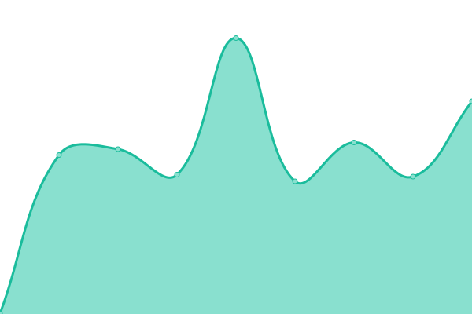 557ms
     
 | 

<a href="https://status.jettaintelligence.com/history/jetta-operating-website">100.00%</a>
    

|  [Jetta Login](https://login.jettaintelligence.com) | 🟩 Up | [jetta-login.yml](https://github.com/jetta-operating/status.jettaintelligence.com/commits/HEAD/history/jetta-login.yml) | 

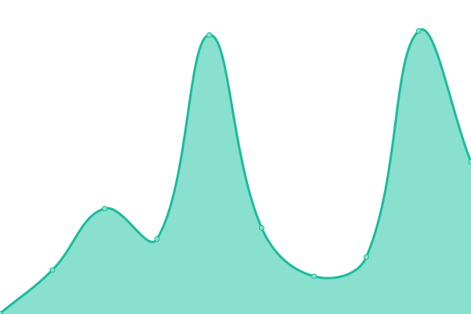 369ms
     
 | 

<a href="https://status.jettaintelligence.com/history/jetta-login">100.00%</a>
    

|  [AIC Holdings Website](https://aicholdings.com) | 🟩 Up | [aic-holdings-website.yml](https://github.com/jetta-operating/status.jettaintelligence.com/commits/HEAD/history/aic-holdings-website.yml) | 

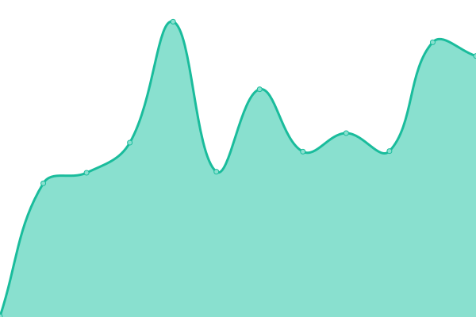 622ms
     
 | 

<a href="https://status.jettaintelligence.com/history/aic-holdings-website">100.00%</a>
    

|  [Sable](https://sable.aicholdings.com) | 🟩 Up | [sable.yml](https://github.com/jetta-operating/status.jettaintelligence.com/commits/HEAD/history/sable.yml) | 

 499ms
     
 | 

<a href="https://status.jettaintelligence.com/history/sable">100.00%</a>
    

|  [Artemis](https://artemis.jettaintelligence.com) | 🟩 Up | [artemis.yml](https://github.com/jetta-operating/status.jettaintelligence.com/commits/HEAD/history/artemis.yml) | 

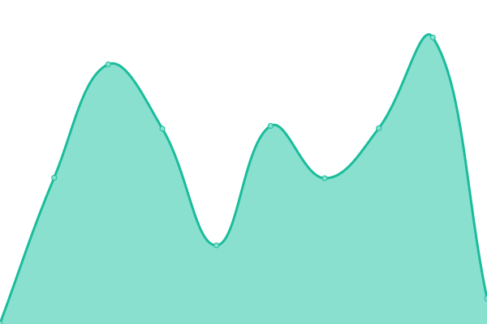 164ms
     
 | 

<a href="https://status.jettaintelligence.com/history/artemis">100.00%</a>
    

|  [Meridian](https://meridian.aicholdings.com) | 🟩 Up | [meridian.yml](https://github.com/jetta-operating/status.jettaintelligence.com/commits/HEAD/history/meridian.yml) | 

 782ms
     
 | 

<a href="https://status.jettaintelligence.com/history/meridian">100.00%</a>
    

|  [Greenmark Website](https://greenmarkwaste.com) | 🟩 Up | [greenmark-website.yml](https://github.com/jetta-operating/status.jettaintelligence.com/commits/HEAD/history/greenmark-website.yml) | 

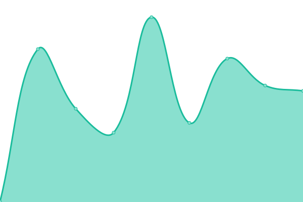 419ms
     
 | 

<a href="https://status.jettaintelligence.com/history/greenmark-website">100.00%</a>
    

|  [HT Disposal Website](https://htdisposal.com) | 🟩 Up | [ht-disposal-website.yml](https://github.com/jetta-operating/status.jettaintelligence.com/commits/HEAD/history/ht-disposal-website.yml) | 

 416ms
     
 | 

<a href="https://status.jettaintelligence.com/history/ht-disposal-website">100.00%</a>
    

|  [Cerebro Production Health](https://cerebro.greenmark.jettaintelligence.com/api/health) | 🟩 Up | [cerebro-production-health.yml](https://github.com/jetta-operating/status.jettaintelligence.com/commits/HEAD/history/cerebro-production-health.yml) | 

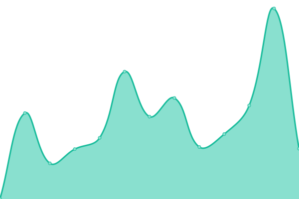 1004ms
     
 | 

<a href="https://status.jettaintelligence.com/history/cerebro-production-health">100.00%</a>
    

|  [Cerebro Staging Health](https://staging-cerebro-greenmark.jettaintelligence.com/api/health) | 🟩 Up | [cerebro-staging-health.yml](https://github.com/jetta-operating/status.jettaintelligence.com/commits/HEAD/history/cerebro-staging-health.yml) | 

 909ms
     
 | 

<a href="https://status.jettaintelligence.com/history/cerebro-staging-health">100.00%</a>
    

|  [Cerebro QA Site](https://qa.cerebro.greenmark.jettaintelligence.com) | 🟩 Up | [cerebro-qa-site.yml](https://github.com/jetta-operating/status.jettaintelligence.com/commits/HEAD/history/cerebro-qa-site.yml) | 

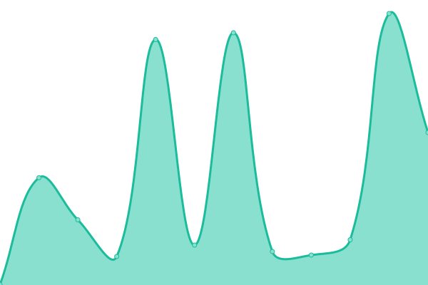 529ms
     
 | 

<a href="https://status.jettaintelligence.com/history/cerebro-qa-site">100.00%</a>
    

|  [Supabase Production Auth Health](https://wwmcgtyngnziepeynccz.supabase.co/auth/v1/health) | 🟩 Up | [supabase-production-auth-health.yml](https://github.com/jetta-operating/status.jettaintelligence.com/commits/HEAD/history/supabase-production-auth-health.yml) | 

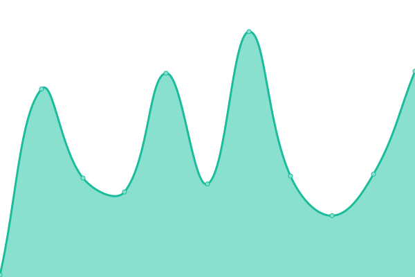 92ms
     
 | 

<a href="https://status.jettaintelligence.com/history/supabase-production-auth-health">100.00%</a>
    

|  [GitHub](https://github.com) | 🟩 Up | [git-hub.yml](https://github.com/jetta-operating/status.jettaintelligence.com/commits/HEAD/history/git-hub.yml) | 

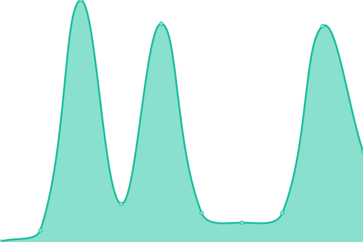 236ms
     
 | 

<a href="https://status.jettaintelligence.com/history/git-hub">98.82%</a>
    

|  [GitHub Status](https://www.githubstatus.com) | 🟩 Up | [git-hub-status.yml](https://github.com/jetta-operating/status.jettaintelligence.com/commits/HEAD/history/git-hub-status.yml) | 

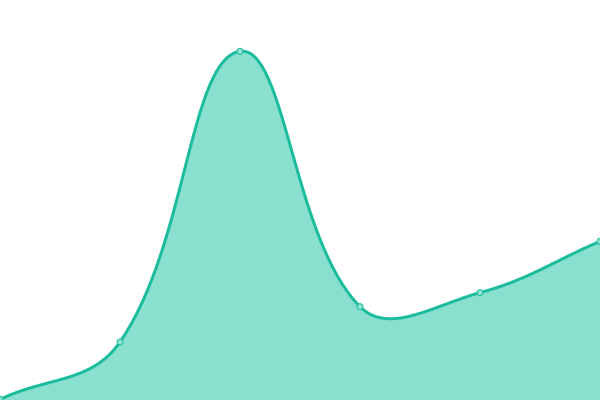 129ms
     
 | 

<a href="https://status.jettaintelligence.com/history/git-hub-status">100.00%</a>
    

|  [Railway Control Plane](https://backboard.railway.com/graphql/v2) | 🟩 Up | [railway-control-plane.yml](https://github.com/jetta-operating/status.jettaintelligence.com/commits/HEAD/history/railway-control-plane.yml) | 

 124ms
     
 | 

<a href="https://status.jettaintelligence.com/history/railway-control-plane">100.00%</a>
    

|  [Railway Status Page](https://status.railway.com/) | 🟩 Up | [railway-status-page.yml](https://github.com/jetta-operating/status.jettaintelligence.com/commits/HEAD/history/railway-status-page.yml) | 

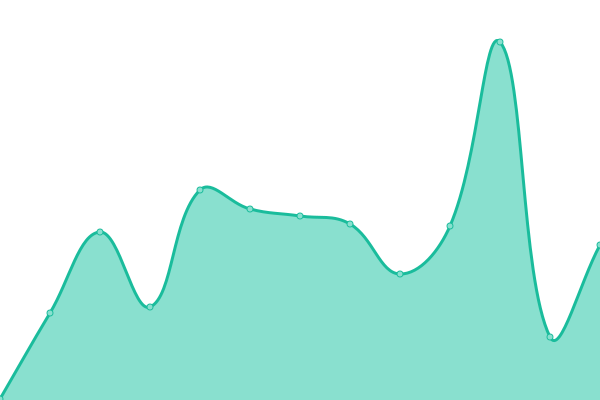 99ms
     
 | 

<a href="https://status.jettaintelligence.com/history/railway-status-page">100.00%</a>
    

|  [Vercel](https://vercel.com) | 🟩 Up | [vercel.yml](https://github.com/jetta-operating/status.jettaintelligence.com/commits/HEAD/history/vercel.yml) | 

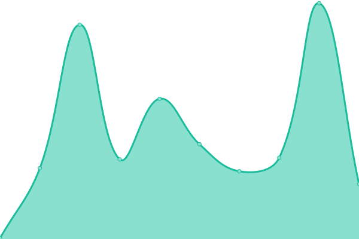 160ms
     
 | 

<a href="https://status.jettaintelligence.com/history/vercel">100.00%</a>
    

|  [Vercel Status](https://www.vercel-status.com/) | 🟩 Up | [vercel-status.yml](https://github.com/jetta-operating/status.jettaintelligence.com/commits/HEAD/history/vercel-status.yml) | 

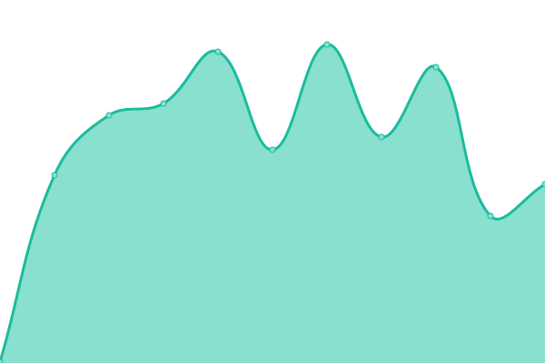 251ms
     
 | 

<a href="https://status.jettaintelligence.com/history/vercel-status">100.00%</a>
    

|  [Supabase Status](https://status.supabase.com/) | 🟩 Up | [supabase-status.yml](https://github.com/jetta-operating/status.jettaintelligence.com/commits/HEAD/history/supabase-status.yml) | 

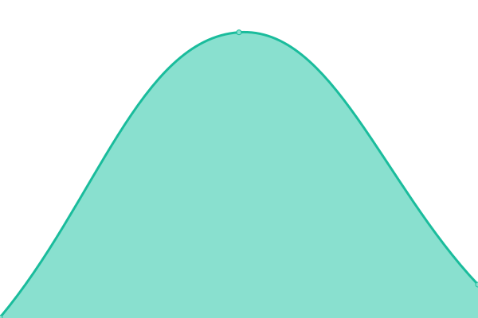 245ms
     
 | 

<a href="https://status.jettaintelligence.com/history/supabase-status">100.00%</a>
    

|  [OpenRouter](https://openrouter.ai) | 🟩 Up | [open-router.yml](https://github.com/jetta-operating/status.jettaintelligence.com/commits/HEAD/history/open-router.yml) | 

 224ms
     
 | 

<a href="https://status.jettaintelligence.com/history/open-router">100.00%</a>
    

|  [OpenRouter API Models](https://openrouter.ai/api/v1/models) | 🟩 Up | [open-router-api-models.yml](https://github.com/jetta-operating/status.jettaintelligence.com/commits/HEAD/history/open-router-api-models.yml) | 

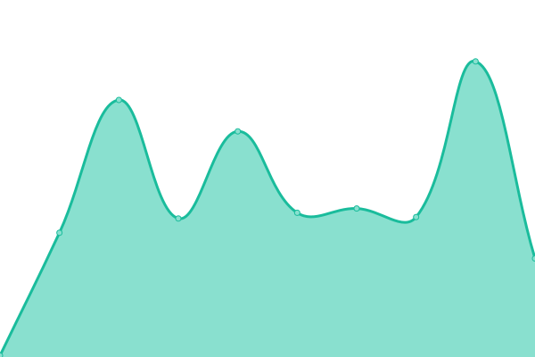 62ms
     
 | 

<a href="https://status.jettaintelligence.com/history/open-router-api-models">100.00%</a>
    

|  [OpenRouter Status](https://status.openrouter.ai) | 🟩 Up | [open-router-status.yml](https://github.com/jetta-operating/status.jettaintelligence.com/commits/HEAD/history/open-router-status.yml) | 

 275ms
     
 | 

<a href="https://status.jettaintelligence.com/history/open-router-status">100.00%</a>
    

|  [Claude Web](https://claude.ai) | 🟩 Up | [claude-web.yml](https://github.com/jetta-operating/status.jettaintelligence.com/commits/HEAD/history/claude-web.yml) | 

 57ms
     
 | 

<a href="https://status.jettaintelligence.com/history/claude-web">100.00%</a>
    

|  [Claude Status All Services](https://status.claude.com) | 🟩 Up | [claude-status-all-services.yml](https://github.com/jetta-operating/status.jettaintelligence.com/commits/HEAD/history/claude-status-all-services.yml) | 

 120ms
     
 | 

<a href="https://status.jettaintelligence.com/history/claude-status-all-services">100.00%</a>
    

|  [Claude Components API](https://status.claude.com/api/v2/components.json) | 🟩 Up | [claude-components-api.yml](https://github.com/jetta-operating/status.jettaintelligence.com/commits/HEAD/history/claude-components-api.yml) | 

 68ms
     
 | 

<a href="https://status.jettaintelligence.com/history/claude-components-api">100.00%</a>
    

|  [Claude Console](https://console.anthropic.com) | 🟩 Up | [claude-console.yml](https://github.com/jetta-operating/status.jettaintelligence.com/commits/HEAD/history/claude-console.yml) | 

 304ms
     
 | 

<a href="https://status.jettaintelligence.com/history/claude-console">100.00%</a>
    

|  [Anthropic API Models](https://api.anthropic.com/v1/models) | 🟩 Up | [anthropic-api-models.yml](https://github.com/jetta-operating/status.jettaintelligence.com/commits/HEAD/history/anthropic-api-models.yml) | 

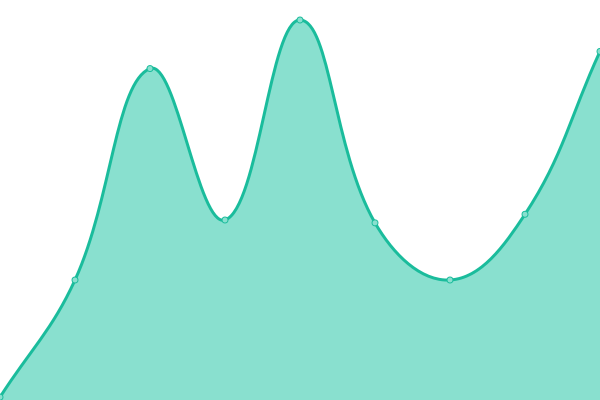 103ms
     
 | 

<a href="https://status.jettaintelligence.com/history/anthropic-api-models">100.00%</a>
    

|  [ChatGPT Web](https://chatgpt.com) | 🟩 Up | [chat-gpt-web.yml](https://github.com/jetta-operating/status.jettaintelligence.com/commits/HEAD/history/chat-gpt-web.yml) | 

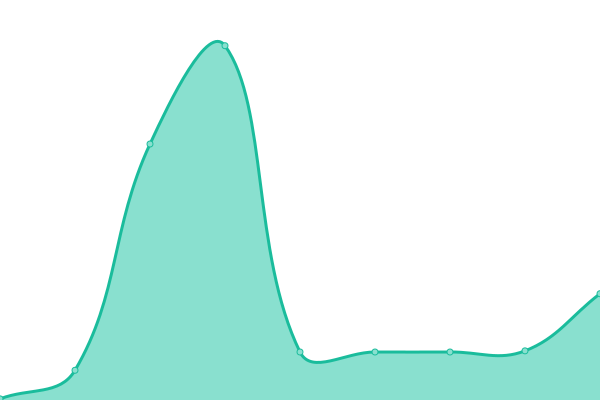 32ms
     
 | 

<a href="https://status.jettaintelligence.com/history/chat-gpt-web">100.00%</a>
    

|  [OpenAI API Models](https://api.openai.com/v1/models) | 🟩 Up | [open-ai-api-models.yml](https://github.com/jetta-operating/status.jettaintelligence.com/commits/HEAD/history/open-ai-api-models.yml) | 

 84ms
     
 | 

<a href="https://status.jettaintelligence.com/history/open-ai-api-models">100.00%</a>
    

|  [OpenAI Status All Services](https://status.openai.com) | 🟩 Up | [open-ai-status-all-services.yml](https://github.com/jetta-operating/status.jettaintelligence.com/commits/HEAD/history/open-ai-status-all-services.yml) | 

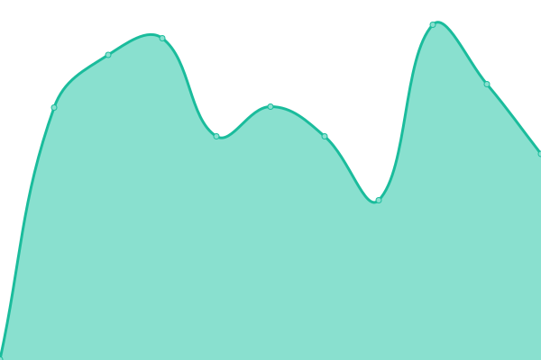 622ms
     
 | 

<a href="https://status.jettaintelligence.com/history/open-ai-status-all-services">100.00%</a>
    

|  [OpenAI Components API](https://status.openai.com/api/v2/components.json) | 🟩 Up | [open-ai-components-api.yml](https://github.com/jetta-operating/status.jettaintelligence.com/commits/HEAD/history/open-ai-components-api.yml) | 

 290ms
     
 | 

<a href="https://status.jettaintelligence.com/history/open-ai-components-api">100.00%</a>
    

<!--end: status pages-->

## Monitored Services

The monitored endpoints are defined in [`.upptimerc.yml`](./.upptimerc.yml).

This repo intentionally monitors only public, non-secret health surfaces. Do not add private API endpoints, bearer tokens, invite links, or other credentialed URLs to Upptime.

## Operations

- Uptime checks run every 15 minutes.
- Response time, graph, summary, and static site workflows can be run manually from GitHub Actions.
- Incidents are tracked as GitHub Issues.
- The custom domain uses a proxied Cloudflare DNS `CNAME` for `status.jettaintelligence.com` pointing at GitHub Pages as the origin.
- Verify the access gate with `tools/configure_cloudflare_access.py --verify-only --strict`.
- `login.jettaintelligence.com` is the Access administration surface. Do not
  route status traffic through that app; both hostnames should be separate
  Cloudflare Access applications governed by the same intended identity policy.
- The org blocks default workflow write permissions; this repo uses a `GH_PAT` Actions secret. The token must include `repo` for status commits and `workflow` before running Upptime template-update automation.
